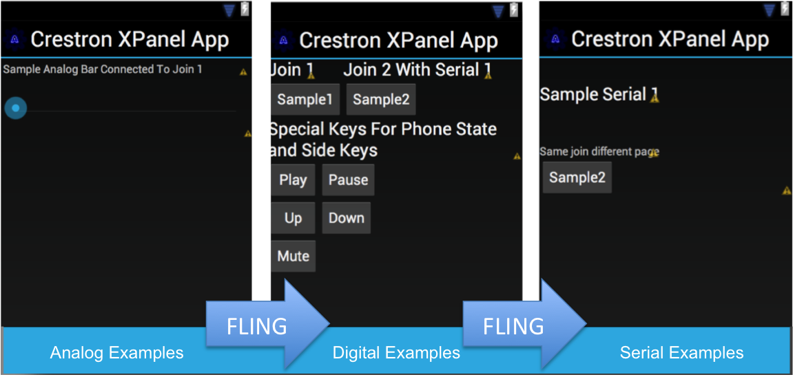

#Custom Crestron XPanel Android Application

##History
Since I couldn't find a native Android app for Crestron systems, I figured I might as well make my own. 
It was called HomeAutomationApp because that was the original purpose of the app for me, but it serverd as a generic Crestron Android app meant for customization to your needs. In the first version I made my own SIMPL module, but that did not allow multiple connections. Once I found an example of the CIP Crestron protocol on GitHub, I modified all the code to use that protocol instead.  I still couldnt find the whole protocol, so I implemented only the parts that were known. If you have the document, please send it to me and I can try to implement more features if they make sense.

###Android 2.3
My original testing was limited to a 800x480 Android 2.3.3 phone, however as things got newer and better (i.e. more mods released), I have have been making to incorporate those added features. The current android 2.3 version is on branch, and will not receive any further updates

##How It Works
With this app you can add buttons, seekbars, or textviews linked to the XPanel (eControl for PC) Digital/Analog/Serial inputs and outputs. All that is necessary is to update the res\ folder (drawable and layouts) to include the images and layouts that you want for the app. I incorporated the built in ViewPager (with TitleStrip) which allows you to "fling" on non-input items so that you can have multiple pages.

1. Install the Android SDK
2. Load the project and build
3. Customize to your needs, changing only the res folder

###Configuring
* The IP, Port, and XPanel IDs are dynamic and can change in the app once you load it. However, you may also choose to edit the [strings](/HomeAutomationApp/res/values/strings.xml) file to your defaults
* The views need to be customized, use the examples [first](/HomeAutomationApp/res/layouts/first.xml) | [second](/HomeAutomationApp/res/layouts/second.xml) | [third](/HomeAutomationApp/res/layouts/third.xml) as a starting point, and use the built in editor to make it look good
* To add or remove views, update the [res/xml/layouts](/HomeAutomationApp/res/xml/layouts.xml) file
* Special keys supported:
  * mute = toggles when phone call received
  * pause/play = goes high (if needed) when phone call occurs - use the toggle in SIMPL feedback to aid
  * sideup/sidedown = connects the volume keys to a button

##More
I also have C# and Python (GLADE) versions of this app if you want a Windows/Mac/Linux mechanism to control your Crestron system. Let me know if you are interested or if you need help. 
